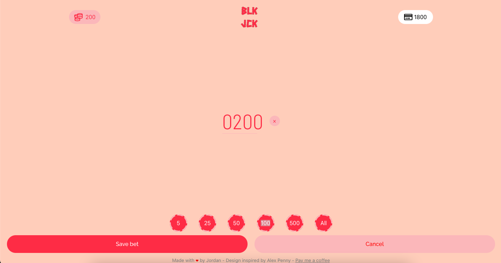
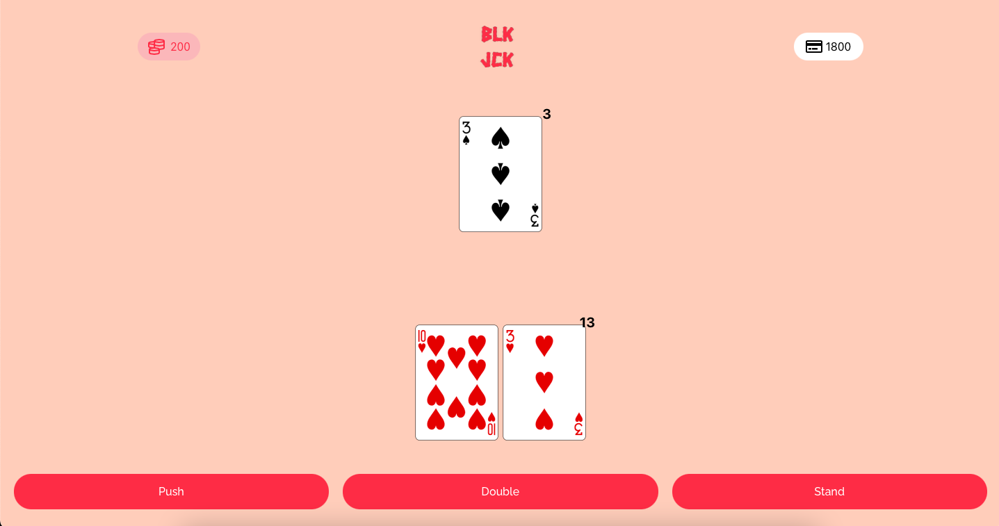
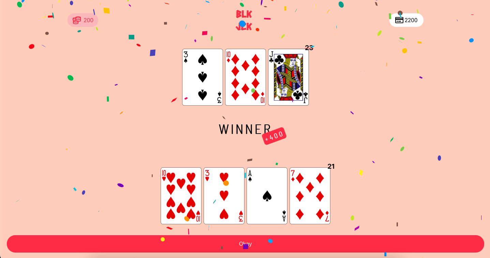
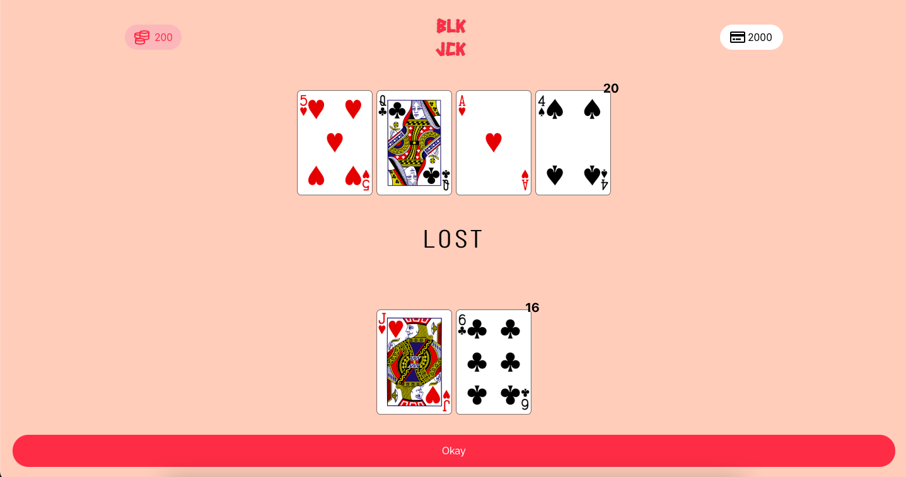

# Minimalist Blackjack Game

**Play game : https://blkjck.netlify.app/**

## Design

Inspiration : [Alex Penny](https://dribbble.com/alexpenny)

## Stack

* ReactJS, CSS

* [Deck of Cards](https://deckofcardsapi.com/) API

Cette API permet de fournir l'image des cartes au format PNG avec les valeurs correspondantes (ex: Roi, Dame, etc.)
> Une amélioration possible serait d'importer nos propres images de cartes et d'adapter le jeu afin d'éviter d'utiliser l'API.
> Cela permettrait que la page se charge plus vite (aucun appel à une API externe), réduction de la dépendance du jeu (si l'API tombe en panne, le jeu fonctionnerait toujours)
